# Battery Grid Service Compensation Calculator - Use Case Documentation

## Business Problem & Context

**The Challenge**: Battery operators face a critical financial dilemma when electricity grid operators (TSOs - Transmission System Operators) request them to deviate from their optimal charging/discharging schedules to provide grid stabilization services. Without proper compensation calculation, battery operators would essentially **provide expensive grid services for free**, undermining their business model and discouraging participation in grid flexibility markets.

**Real-World Impact**: 
- Battery operators lose revenue from their original profitable trading strategies
- Grid operators need accurate cost assessments to budget for flexibility services
- Regulators require transparent, auditable compensation calculations
- The energy transition depends on fair market mechanisms that incentivize grid-supporting investments

## Solution Approach

This system calculates **exact fair compensation** by:

1. **Determining Optimal Operation**: What the battery would have earned with its original profit-maximizing schedule
2. **Assessing Actual Operation**: What it actually earns when following TSO requests
3. **Computing Lost Opportunity**: The financial difference as the fair compensation amount
4. **Advanced Financial Modeling**: Using sophisticated methods including Black-Scholes option pricing for accurate valuation
5. **Regulatory Compliance**: Generating TSO-compliant reports for regulatory submission

## Core Architecture & Component Purposes

### Configuration & Data Management
- **`config.py`**: Centralizes all system parameters (battery specifications, market settings, file paths) into a single, validated configuration object that ensures consistency across all calculations.

- **`data_loader.py`**: Handles the complex task of loading and preprocessing market price data from Excel files, cleaning timestamps, validating data quality, and preparing it for analysis.

- **`models.py`**: Defines type-safe data models (Price, Energy) that provide clear interfaces and prevent unit conversion errors throughout the calculation pipeline.

### Market Analysis & Price Forecasting
- **`market_analysis.py`**: Performs sophisticated price analysis by calculating historical price differences between day-ahead and intraday markets, then uses this to forecast expected intraday prices for the delivery date, essential for accurate revenue projections.

### Economic Optimization
- **`optimization.py`**: Implements the core economic logic that determines optimal battery operation schedules by finding boundary prices (minimum profitable discharge price, maximum profitable charge price) and calculating the cost of flexibility services when deviating from optimal operation.

### Financial Modeling & Cost Calculation
- **`cost_calculation.py`**: Contains advanced financial models including Black-Scholes option pricing to value flexibility services, calculates production opportunity costs when schedules change, and computes depreciation costs from suboptimal battery operation.

### Compliance & Reporting
- **`reporting.py`**: Generates comprehensive Excel reports that meet TSO regulatory requirements, providing transparent documentation of all calculations and assumptions for audit purposes.

### Main Orchestration
- **`calculator.py`**: Acts as the primary facade that orchestrates the entire calculation workflow, managing data flow between components while keeping the complexity hidden from end users through a simple, unified interface.

## Business Value Delivered

- **For Battery Operators**: Ensures fair compensation, preventing financial losses when providing grid services
- **For Grid Operators**: Provides transparent, defensible cost calculations for budgeting flexibility services
- **For Regulators**: Enables audit and verification of grid service compensation calculations
- **For the Energy System**: Creates fair market mechanisms that encourage grid-supporting investments

## Technical Workflow & Data Flow

The system follows a carefully orchestrated 11-step process where each component contributes specific expertise to the overall solution. The diagram below shows the complete data flow, including what specific outputs each component passes to the next:

```mermaid
flowchart LR
    A["**Start Calculation**<br>calculator.py"] --> B["**1. Load Market Data**<br>data_loader.py"]
    B -- "_market_data<br>(Historical Price Data 90+ days)" --> C["**2. Calculate Price Adjustments**<br>market_analysis.py"]
    C -- "_adjusted_prices<br>(DA Prices + Average Diff)" --> D["**3. Find Boundary Prices**<br>optimization.py"]
    D -- "_boundary_prices<br>(4-tuple: min_gen, max_pump,<br>total_gen_energy, total_pump_energy)" --> E["**4. Calculate Flexibility Costs**<br>optimization.py"]
    E -- "_flexibility_service_costs<br>(4-tuple TSO Payment Prices)" --> F["**5. Calculate Volatility**<br>market_analysis.py"]
    
    B --> F
    F -- "_standard_deviations<br>(Historical Volatilities)" --> G["**6. Calculate Option Prices**<br>cost_calculation.py"]
    C --> G
    D --> G
    G -- "_option_prices<br>(DataFrame: discharge_option_price,<br>charge_option_price, standard_deviation)" --> H["**7. Load Schedule Data**<br>data_loader.py"]
    
    H -- "_operational_schedule_data<br>(15-min intervals: Pt, Prd, Pnew,<br>RedispatchType, reserved capacities)" --> I["**8. Calculate Production Costs**<br>cost_calculation.py"]
    G --> I
    E --> I
    I -- "costs_production_opportunity<br>(DataFrame with blocked capacities<br>+ opportunity & production costs)" --> J["**9. Calculate Depreciation**<br>cost_calculation.py"]
    
    D --> J
    C --> J
    J -- "cost_deprecation<br>(DataFrame with depreciation costs<br>added to production costs)" --> K["**10. Aggregate Costs**<br>cost_calculation.py"]
    K -- "aggregated_costs<br>(Final DataFrame with all cost<br>components aggregated)" --> L["**11. Generate TSO Report**<br>reporting.py"]
    
    H --> L
    G --> L
    E --> L
    D --> L
    L --> M["**End: Compensation Amount**<br>+ Regulatory Reports"]
    L --> Q["**Output Files**<br>• cost_values.xlsx<br>• tso_report.xlsx"]

     A:::startEnd
     B:::process
     C:::process
     D:::process
     E:::process
     F:::process
     G:::process
     H:::process
     I:::process
     J:::process
     K:::process
     L:::process
     M:::startEnd
     Q:::files
    classDef startEnd fill:#e1f5fe,stroke:#0277bd,stroke-width:3px
    classDef process fill:#f3e5f5,stroke:#7b1fa2,stroke-width:2px
    classDef data fill:#e8f5e8,stroke:#2e7d32,stroke-width:2px
    classDef config fill:#fff3e0,stroke:#f57c00,stroke-width:2px
    classDef files fill:#fce4ec,stroke:#c2185b,stroke-width:2px
```

### Key Data Transfers & Intermediate Outputs

The calculator stores intermediate results that are reused across multiple calculation steps:

- **`_market_data`** (Step 1→2,5): Historical price data reused for both price adjustments and volatility calculations
- **`_adjusted_prices`** (Step 2→3,6,9): Forecasted intraday prices used in boundary optimization, option pricing, and depreciation calculations
- **`_boundary_prices`** (Step 3→4,6,9,11): 4-tuple containing min/max profitable prices and total energies, reused in flexibility costs, option pricing, depreciation, and TSO reporting
- **`_flexibility_service_costs`** (Step 4→8,11): 4-tuple of TSO payment prices reused in production cost calculations and TSO reporting
- **`_standard_deviations`** (Step 5→6): Historical volatilities required for Black-Scholes option pricing
- **`_option_prices`** (Step 6→8,11): DataFrame with discharge/charge option prices reused in production costs and TSO reporting
- **`_operational_schedule_data`** (Step 7→8,11): 15-minute operational schedule reused in production costs and TSO reporting
- **`costs_production_opportunity`** (Step 8→9): Production costs DataFrame passed to depreciation calculation
- **`cost_deprecation`** (Step 9→10): Enhanced DataFrame with depreciation costs added
- **`aggregated_costs`** (Step 10→Return): Final compensation amount with all cost components

This architecture ensures that each calculation builds upon the previous results, maintaining mathematical consistency while allowing individual components to be tested and validated independently. 